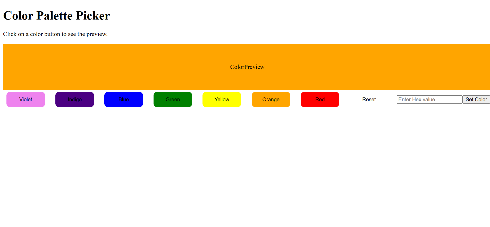

# 🎨 Color Palette Picker

A simple and interactive React + TypeScript application that lets users pick and preview colors using predefined buttons or custom hex values.

---

## 📸 Screenshot

---

## 🚀 Features

- 🎨 Click a color button to instantly preview it
- 🔢 Enter a custom hex color value (e.g. `ff6347`) and apply it
- 🧼 Reset button to clear selection (default to white)
- ⚛️ Built with React + TypeScript

---

## 📂 Project Structure

src/
├── components/
│ ├── ColorButton.tsx # Button component for selecting a color
│ └── ColorPreview.tsx # Preview display of the selected color
├── App.tsx # Main app component
├── App.css # Styles
└── main.tsx / index.tsx # Entry point

